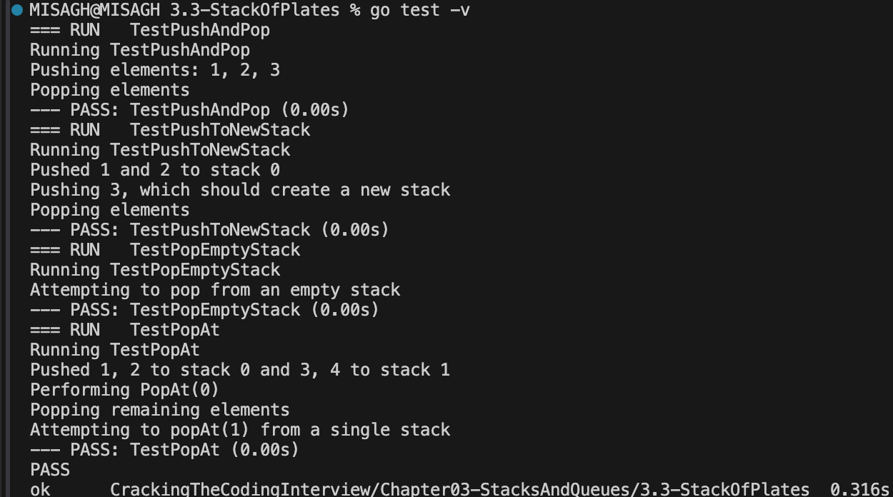

### 3.3 Stack of Plates
Imagine a (literal) stack of plates. 
If the stack gets too high, it might topple.
Therefore, in real life, we would likely start a new stack when the previous stack exceeds some threshold.
Implement a data structure SetOfStacks that mimics this.
SetOfStacks should be composed of several stacks and should create a new stack once the previous one exceeds capacity.
SetOfStacks.push() and SetOfStacks.pop() should behave identically to a single stack (that is, pop() should return the same values as it would if there were just a single stack).
##### FOLLOW UP
Implement a function popAt(int index) which performs a pop operation on a specific sub-stack.

`go test -v`

